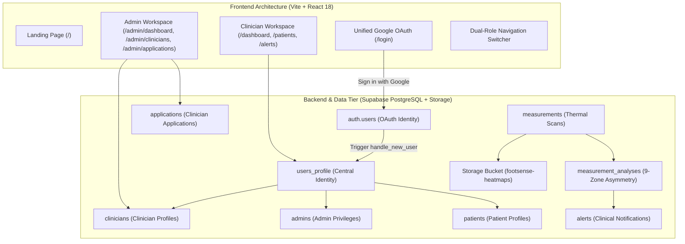

# FootSense — Intelligent Diabetic Foot Monitoring Platform

[](https://reactjs.org/)
[](https://www.typescriptlang.org/)
[](https://vitejs.dev/)
[](https://tailwindcss.com/)
[](https://supabase.com/)
[](https://tanstack.com/query)

FootSense is a clinical-grade diabetic foot monitoring and telehealth platform. It continuously captures, calibrates, and evaluates bilateral plantar thermal telemetry from IoT sensor insoles to detect pre-ulcerative thermal hotspots before skin breakdown occurs.

---

## Table of Contents
1. [Clinical Background & Objective](#1-clinical-background--objective)
2. [Key Platform Features](#2-key-platform-features)
3. [System Architecture](#3-system-architecture)
4. [Database Schema & ER Diagram](#4-database-schema--er-diagram)
5. [Database Views & Stored Procedures (RPCs)](#5-database-views--stored-procedures-rpcs)
6. [Security & Account Suspension Model](#6-security--account-suspension-model)
7. [Database Migrations Reference](#7-database-migrations-reference)
8. [Getting Started & Local Development](#8-getting-started--local-development)
9. [Environment Variables](#9-environment-variables)
10. [Repository Structure](#10-repository-structure)

---

## 1. Clinical Background & Objective

Diabetic Foot Ulcers (DFUs) are among the most severe complications of diabetes mellitus, frequently preceding lower-extremity amputations. Peripheral neuropathy deprives patients of protective pain sensation, allowing tissue inflammation to progress unnoticed.

* **Pathophysiological Marker:** Localized sub-surface inflammation produces elevated cutaneous temperature (thermal hotspots).
* **Clinical Threshold:** A persistent bilateral temperature asymmetry $\Delta T \ge 2.2^\circ\text{C}$ between identical anatomical zones of contralateral feet indicates impending ulceration.
* **FootSense Strategy:** By pairing daily sensor measurements (calibrated across a 20×8 grid and 9 anatomical zones) with automated telemetry analytics, FootSense alerts clinicians to microvascular inflammation days before visual ulceration manifests.

---

## 2. Key Platform Features

### 🩺 Clinician Portal (`/dashboard`)
* **Clinical Overview:** High-level statistics on assigned patient cohort, total alerts, and severe thermal asymmetries.
* **Patient Roster & Monitoring:** Patient registry with risk badges (Low, Moderate, High), diabetes history, and last scan timestamps.
* **Thermal Analysis & Heatmaps:**
  * Inline rendering of calibrated thermal images from cloud storage (`detected_9pts_url`, `room_calibrated_url`, `raw_url`).
  * 9 anatomical zone comparison table:
    * Big Toe (Hallux), 3rd Toe, 5th Toe
    * 1st Metatarsal (Inner Ball), 3rd Metatarsal (Center Ball), 5th Metatarsal (Outer Ball)
    * Medial Midfoot (Arch), Lateral Midfoot
    * Heel (Calcaneus)
  * Asymmetry charts tracking temperature differentials against historical baselines.
* **Alerts Centre:** Filterable alert stream categorized by urgency (Low, Moderate, High, Critical) with one-click clinician acknowledgment.
* **Clinical Notes & Care Directives:** Persistent remarks and treatment instructions with urgency flags (routine, important, urgent).
* **Doctor-Patient Assignment Management:** Review and accept incoming patient assignment requests.

### 🛡️ Administrator Portal (`/admin/*`)
* **Admin Dashboard:** Platform-wide metrics (Active Clinicians, Suspended Clinicians, Pending Applications, Total Patients).
* **Clinician Management:**
  * **Account Status Switch:** Instant toggling of clinician accounts between **Active** and **Suspended** state with real-time UI synchronization and database persistence.
  * **Role Management:** Standardized actions to promote clinicians to Administrator or demote administrators back to Clinician.
* **Clinician Onboarding Review:** Verification of applicant credentials, AHPRA numbers, and institutional affiliations with one-click approval (triggering automated user provisioning) or decline with custom clinical notes.

### 🔄 Multi-Role Architecture
* **Dual-Role Support:** Clinicians who are elevated to Administrator maintain their complete clinical profile, patient assignments, and historical records.
* **Instant Role Switcher:** Switch between the Clinician portal and Admin portal seamlessly from the navigation header without signing out.
* **Root Administrator Protection:** Root admin `foot.sense.monash@gmail.com` holds exclusive authority to demote administrators, while other administrators can promote clinicians.

### 🌐 Public Services
* **Application Tracker (`/status`):** Secure, publicly accessible status checker for clinician applicants by email or AHPRA number.
* **Clinician Registration (`/register`):** Streamlined registration flow with institutional and AHPRA credential submissions.

---

## 3. System Architecture



---

## 4. Database Schema & ER Diagram

The database architecture is built on PostgreSQL with strict Row-Level Security (RLS), automated triggers, and foreign key cascades.

```mermaid
erDiagram
    users_profile ||--o| admins : "elevated to admin (1:0..1)"
    users_profile ||--o| clinicians : "registered as clinician (1:0..1)"
    users_profile ||--o| patients : "registered as patient (1:0..1)"
    users_profile ||--o{ patients : "assigned clinician (1:N)"
    users_profile ||--o{ applications : "reviewed by admin (1:N)"
    users_profile ||--o{ assignment_requests : "patient in request (1:N)"
    users_profile ||--o{ assignment_requests : "clinician in request (1:N)"
    users_profile ||--o{ measurements : "measured patient (1:N)"
    users_profile ||--o{ alerts : "patient alerts (1:N)"
    users_profile ||--o{ remarks : "patient remarks (1:N)"
    users_profile ||--o{ remarks : "author clinician (1:N)"
    users_profile ||--o{ instructions : "patient instructions (1:N)"
    users_profile ||--o{ instructions : "author clinician (1:N)"
    measurements ||--o{ measurement_analyses : "generates analysis (1:N)"
    measurements ||--o{ alerts : "triggers alert (1:N)"

    users_profile {
        uuid id PK "gen_random_uuid()"
        uuid auth_id UK "Links to auth.users(id)"
        text email UK "Unique user email"
        text first_name "First name"
        text last_name "Last name"
        text role "user | clinician | admin"
        boolean is_admin "Dual-role admin flag"
        text auth_provider "Default: google"
        text avatar_url "Avatar image URL"
        timestamptz created_at
        timestamptz updated_at
    }

    admins {
        uuid user_id PK, FK "References users_profile(id) ON DELETE CASCADE"
        jsonb permissions "Granular permissions JSON"
        text notes "Admin internal notes"
        timestamptz created_at
    }

    clinicians {
        uuid user_id PK, FK "References users_profile(id) ON DELETE CASCADE"
        text specialty "Medical specialty"
        text institution "Hospital or clinic name"
        text ahpra_number "AHPRA medical registration"
        text status "Account status: active | suspended"
        timestamptz last_login "Last session timestamp"
        timestamptz created_at
        timestamptz updated_at
    }

    patients {
        uuid user_id PK, FK "References users_profile(id) ON DELETE CASCADE"
        uuid clinician_id FK "Assigned clinician: references users_profile(id)"
        date date_of_birth "Date of birth"
        text gender "male, female, other, prefer_not_to_say"
        text diabetes_type "Type 1, Type 2, Gestational, Pre-diabetes, Other"
        integer diagnosis_year "Year diagnosed"
        text mobile_number "Contact telephone"
        jsonb emergency_contact "Contact person details"
        text status "active, inactive, archived"
        text notes "Clinical case notes"
        numeric baseline_left_celsius "Left foot baseline temp"
        numeric baseline_right_celsius "Right foot baseline temp"
        timestamptz baseline_scan_date "Baseline calibration timestamp"
        timestamptz created_at
        timestamptz updated_at
    }

    applications {
        uuid id PK "gen_random_uuid()"
        text applicant_email "Clinician email address"
        text first_name "Applicant first name"
        text last_name "Applicant last name"
        text ahpra_number "AHPRA registration number"
        text specialty "Specialty"
        text institution "Health institution"
        text phone "Phone number"
        jsonb documents "Document attachments"
        text status "pending | approved | declined"
        text notes "Reviewer feedback or notes"
        timestamptz submitted_at "Submission timestamp"
        timestamptz reviewed_at "Review timestamp"
        uuid reviewed_by FK "Reviewer: references users_profile(id)"
    }

    assignment_requests {
        uuid id PK "gen_random_uuid()"
        uuid patient_id FK "Patient: references users_profile(id)"
        uuid clinician_id FK "Clinician: references users_profile(id)"
        text status "pending | accepted | declined"
        timestamptz requested_at
        timestamptz reviewed_at
        uuid reviewed_by FK "Reviewer: references users_profile(id)"
        text notes
    }

    measurements {
        uuid id PK "gen_random_uuid()"
        uuid user_id FK "Patient: references users_profile(id)"
        text session_id "Device scan session ID"
        text device_id "Hardware sensor MAC/Serial"
        jsonb tmp117_session "High-precision ambient temp telemetry"
        timestamptz recorded_at "Scan acquisition timestamp"
        jsonb images "URLs for raw, calibrated, and 9pts images"
        jsonb analysis "Telemetry matrices and asymmetry map"
        text status "processing | completed | failed"
        timestamptz created_at
    }

    measurement_analyses {
        uuid id PK "gen_random_uuid()"
        uuid measurement_id FK "References measurements(id) ON DELETE CASCADE"
        uuid user_id FK "Patient: references users_profile(id)"
        timestamptz recorded_at
        numeric max_asymmetry_celsius "Peak bilateral temperature delta"
        boolean alert_triggered "True if asymmetry exceeds threshold"
        text alert_severity "low, medium, high, critical"
        jsonb zone_asymmetry "9-zone anatomical asymmetry mapping"
        jsonb clinical_points_left "Left foot clinical zone points"
        jsonb clinical_points_right "Right foot clinical zone points"
        jsonb calibrated_left "20x8 sensor thermal matrix"
        jsonb calibrated_right "20x8 sensor thermal matrix"
        timestamptz created_at
    }

    alerts {
        uuid id PK "gen_random_uuid()"
        uuid measurement_id FK "References measurements(id) ON DELETE CASCADE"
        uuid user_id FK "Patient: references users_profile(id)"
        text type "thermal_asymmetry, hardware_fault, missed_scan, adherence_drop"
        text severity "low, moderate, high, critical"
        text title "Alert title"
        text message "Clinical explanation"
        text status "open, acknowledged, resolved"
        boolean acknowledged "Acknowledgment boolean"
        timestamptz acknowledged_at
        uuid acknowledged_by FK "Clinician: references users_profile(id)"
        timestamptz created_at
    }

    remarks {
        uuid id PK "gen_random_uuid()"
        uuid patient_id FK "Patient: references users_profile(id)"
        uuid clinician_id FK "Clinician author: references users_profile(id)"
        text text "Clinical observation note"
        text category "general, urgent, follow_up, clinical_note"
        timestamptz created_at
        timestamptz updated_at
    }

    instructions {
        uuid id PK "gen_random_uuid()"
        uuid patient_id FK "Patient: references users_profile(id)"
        uuid clinician_id FK "Clinician author: references users_profile(id)"
        text text "Prescribed care directive"
        text status "pending, in_progress, completed, cancelled"
        text priority "routine, important, urgent"
        date due_date "Target completion date"
        timestamptz created_at
        timestamptz updated_at
    }
```



---

## 5. Database Views & Stored Procedures (RPCs)

### Core Database Views
1. **`clinician_summary`**:
   Combines `users_profile` with `clinicians`, active patient counts, and administrative privilege status (`is_admin`). Exposes `status` (`'active'` or `'suspended'`) for clinician registry tables.
2. **`patient_summary`**:
   Joins patient profiles with their assigned clinician's full name, baseline metrics, latest scan temperature asymmetry, and active alert severity counts.
3. **`alert_with_patient_name`**:
   Flattens alert data with the corresponding patient's full name, email, and scan session for real-time clinician alerts.

### Stored Procedures (RPCs)
| Function | Access | Description |
|---|---|---|
| `get_current_user_profile()` | `authenticated`, `anon` | Resolves the authenticated user's profile, roles array (`['clinician', 'admin']`), and account standing. Enforces suspension by stripping the clinician role if suspended. |
| `promote_clinician_to_admin(target_user_id UUID)` | `authenticated` (Admin) | Promotes a clinician to Administrator non-destructively by inserting into `admins` and setting `is_admin = true`. Clinical records and patient assignments remain untouched. |
| `demote_admin_to_clinician(target_user_id UUID)` | `authenticated` (Root Admin) | Restricts demotion exclusively to `foot.sense.monash@gmail.com`. Protects root admin from demotion. |
| `set_clinician_status(target_user_id UUID, new_status TEXT)` | `authenticated` (Admin) | Atomically updates clinician status to `'active'` or `'suspended'`. Automatically audited. |
| `lookup_application_status(query_text TEXT)` | `anon`, `authenticated` | Public RPC allowing clinician applicants to track application status safely by email or AHPRA number. |
| `get_auth_profile_id(uid UUID)` | `authenticated`, `service_role` | Translates Google OAuth `auth.uid()` to the true `users_profile.id`. |
| `get_user_role(user_id UUID)` | `authenticated`, `service_role` | Resolves user role for RLS. Returns `'suspended'` for suspended clinicians, rejecting access to patient data. |

### Triggers
1. **`handle_new_user` (`auth.users` -> `public.users_profile`)**:
   Automatically links new OAuth logins with existing pre-approved clinician profiles by email, preventing account collisions.
2. **`handle_application_approval_change` (`public.applications`)**:
   When an administrator approves a clinician application (`status = 'approved'`), automatically provisions their `users_profile` and creates an active `clinicians` record.

---

## 6. Security & Account Suspension Model

FootSense implements a strict multi-layer security model to protect clinical patient data:

1. **Database Layer (RLS Enforcement):**
   * When an account is suspended, `get_user_role()` evaluates to `'suspended'` rather than `'clinician'`.
   * PostgreSQL RLS policies on `patients`, `measurements`, `alerts`, and `remarks` immediately reject SELECT and UPDATE operations for that user.
2. **Session Layer (`AuthContext`):**
   * On login or session restoration, `resolveUser()` checks `status === 'suspended'`.
   * If suspended without admin privileges, login is rejected, existing sessions are purged, and a descriptive suspension notice is returned.
3. **Route Protection Layer (`ProtectedRoute`):**
   * If a suspended clinician attempts to access clinical routes (`/dashboard`, `/patients`, `/alerts`), `ProtectedRoute` blocks access and renders the **Account Suspended** warning panel.
4. **Real-Time Polling & Window Focus:**
   * Active browser sessions continuously verify account standing. If an administrator suspends a clinician while they have the application open, their session is updated within seconds.

---

## 7. Database Migrations Reference

All migrations are located in `supabase/migrations/`:

| Migration | Focus Area |
|---|---|
| `001`–`012` | Initial schema setup (admins, clinicians, patients, measurements, alerts, applications, remarks, instructions). |
| `013`, `017` | Storage bucket configuration (`footsense-heatmaps`). |
| `014`, `029` | Seed data and mock patient clinical datasets. |
| `015`, `030` | Central `users_profile` table and NOT NULL constraints. |
| `016`, `032` | Thermal measurement JSONB schema and TMP117 session telemetry columns. |
| `018`–`028` | Schema normalization (V2 schemas, improved foreign keys, and indexes). |
| `031`, `040` | Robust fail-safe user provisioning triggers for Google OAuth identity synchronization. |
| `033` | Translation helper `get_auth_profile_id` and Row-Level Security update across all tables. |
| `034`, `037` | Automated clinician onboarding triggers on application approval and `lookup_application_status` RPC. |
| `035` | Profile and clinician update RLS policies. |
| `036` | AHPRA uniqueness index and registration cleanup. |
| `038` | Self-healing `get_current_user_profile()` RPC. |
| `039` | Mock patient telemetry linking with high-asymmetry scans. |
| `041` | Dual-role support (Clinician + Administrator), `admins` elevation, and promotion RPC. |
| `042` | Root admin demotion restriction (`foot.sense.monash@gmail.com`), `set_clinician_status` RPC, and suspension RLS enforcement. |

---

## 8. Getting Started & Local Development

### Prerequisites
* **Node.js**: `v18.0.0` or higher
* **npm**: `v9.0.0` or higher
* A Supabase project with PostgreSQL and Storage enabled.

### 1. Clone & Install Dependencies
```bash
git clone <repository-url>
cd webapp_new
npm install
```

### 2. Environment Configuration
Create a `.env.local` file in the root directory:
```env
VITE_SUPABASE_URL=https://your-project-id.supabase.co
VITE_SUPABASE_ANON_KEY=your-supabase-anon-key
VITE_SUPABASE_HEATMAPS_BUCKET=footsense-heatmaps
```

### 3. Database Migration Setup
Execute the migration scripts in the Supabase SQL Editor in numerical order:
1. Run initial migrations `001` through `040`.
2. Run `041_dual_role_support_and_promote_e20069.sql` for dual-role capabilities.
3. Run `042_root_admin_demote_restriction.sql` for admin demote restrictions and suspension enforcement.

### 4. Run the Local Development Server
```bash
npm run dev
```
The application will start locally at `http://localhost:8082` (or the configured port).

### 5. Type Checking & Production Build
```bash
# Run TypeScript compilation check
npx tsc --noEmit

# Run production Vite build
npm run build
```
Generates an optimized static bundle in the `dist/` directory.

### 6. Development & Testing Roles
| Role | Email Identifier | Portal Access |
|---|---|---|
| **Root Administrator** | `foot.sense.monash@gmail.com` | Full Administrative & Dual-Role Clinician Access, Admin Demotion Rights |
| **Clinician (Sample)** | `sarah.chen@citymedical.com` | Patient Roster, Alerts Centre, Thermal Telemetry Review, Care Directives |

---

## 9. Environment Variables

| Variable | Required | Description |
|---|---|---|
| `VITE_SUPABASE_URL` | **Yes** | The HTTPS URL of your Supabase project instance. |
| `VITE_SUPABASE_ANON_KEY` | **Yes** | The public anonymous JWT key for client-side queries. |
| `VITE_SUPABASE_HEATMAPS_BUCKET` | Optional | Supabase storage bucket name for thermal foot heatmaps (default: `footsense-heatmaps`). |

---

## 10. Repository Structure

```text
webapp_new/
├── public/                     # Static assets (FootSense SVG, ICO, and PNG favicons)
│   ├── favicon.svg             # Crisp vector brand icon
│   ├── favicon.ico             # Multi-resolution legacy icon
│   └── favicon.png             # High-DPI app icon
├── src/
│   ├── components/             # Reusable UI & Layout Components
│   │   ├── auth/               # ProtectedRoute, SignOutConfirmDialog
│   │   ├── layout/             # ClinicianLayout, AdminLayout, NavItems
│   │   ├── ui/                 # Shadcn UI primitives (Button, Switch, Dialog, etc.)
│   │   ├── ThermalFoot.tsx     # Plantar heatmap viewer with 9-point overlay
│   │   └── RiskBadge.tsx       # Standardized Low/Moderate/High risk indicators
│   ├── config/                 # Application routing constants
│   ├── context/
│   │   └── AuthContext.tsx     # Supabase session manager & role resolution
│   ├── controllers/            # Controller layer orchestrating services and views
│   ├── models/                 # Data access layer (Supabase table mappers)
│   ├── pages/                  # Top-level Page Views
│   │   ├── LandingPage.tsx     # Public promotional landing page
│   │   ├── LoginPage.tsx       # Unified Google OAuth sign-in
│   │   ├── RegisterPage.tsx    # Clinician onboarding application form
│   │   ├── RegisterStatusPage.tsx # Public application status tracking
│   │   ├── ClinicianDashboardPage.tsx # Clinician main dashboard
│   │   ├── PatientListPage.tsx # Patient registry table
│   │   ├── PatientDetailPage.tsx # In-depth thermal scans, notes, and charts
│   │   ├── AlertsCentrePage.tsx # Real-time clinical alerts
│   │   ├── AdminDashboardPage.tsx # Admin platform metrics
│   │   ├── AdminCliniciansPage.tsx # Clinician management & status toggle
│   │   └── AdminApplicationsPage.tsx # Onboarding approval queue
│   ├── services/               # Business logic and Supabase RPC integrations
│   ├── types/                  # TypeScript interfaces and domain models
│   ├── utils/                  # Date formatting, clinical risk calculations
│   ├── App.tsx                 # Main route configuration
│   └── main.tsx                # React DOM entry point with QueryClientProvider
├── supabase/
│   └── migrations/             # Full SQL migrations 001 through 042
├── index.html                  # HTML entry point with FootSense branding
├── vite.config.ts              # Vite configuration
└── package.json                # Project dependencies and build scripts
```

---

## 11. Clinical & Security Disclaimers

* **Clinical Decision Support:** FootSense is an assistive clinical decision support tool designed to aid licensed podiatrists, endocrinologists, and healthcare professionals. It does not replace comprehensive in-person medical evaluation.
* **Data Confidentiality:** All patient telemetry, identifying records, and clinical observations are subject to Row-Level Security and strict institutional access governance.
