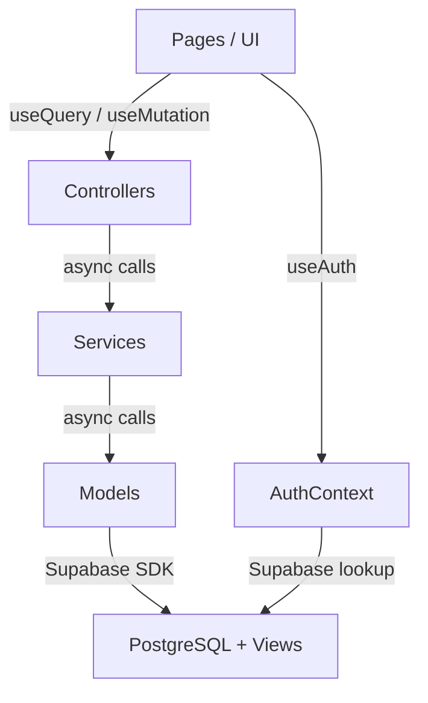

# Phase 2 Walkthrough — Mock → Supabase Migration

## Summary
Rewired the entire clinician-web frontend from in-memory mock data (`mockData.ts`) to live **async Supabase** queries. Every layer of the MCS architecture (Models → Services → Controllers → Pages) was migrated systematically. **35+ files** changed.

## Architecture

---

## Changes Made

### Layer 0: Infrastructure
| File | Change |
|------|--------|
| [main.tsx](file:///d:/Footsens/clinician-web/src/main.tsx) | Wrapped app in `QueryClientProvider` |
| [supabaseClient.ts](file:///d:/Footsens/clinician-web/src/lib/supabaseClient.ts) | Fixed bracket env access for TS4111 |

### Layer 1: Types
| File | Change |
|------|--------|
| [types/index.ts](file:///d:/Footsens/clinician-web/src/types/index.ts) | Full rewrite — JSONB schema, `UserRole`, new fields |

### Layer 2: Models (8 files)
All models → `async/await` + `supabase.from(...).select()`:

| Model | Key Logic |
|-------|-----------|
| [measurementModel.ts](file:///d:/Footsens/clinician-web/src/models/measurementModel.ts) | JSONB→`MeasurementAnalysis` mapper, `deriveRiskScore`, `deriveRiskLevel` |
| [patientModel.ts](file:///d:/Footsens/clinician-web/src/models/patientModel.ts) | Reads from `patient_summary` view |
| [clinicianModel.ts](file:///d:/Footsens/clinician-web/src/models/clinicianModel.ts) | Reads from `clinician_summary` view |
| [alertModel.ts](file:///d:/Footsens/clinician-web/src/models/alertModel.ts) | `acknowledge()` mutation |
| [applicationModel.ts](file:///d:/Footsens/clinician-web/src/models/applicationModel.ts) | `updateStatus()` with decline reason |
| [assignmentRequestModel.ts](file:///d:/Footsens/clinician-web/src/models/assignmentRequestModel.ts) | `updateStatus()` accept/decline |
| [remarkModel.ts](file:///d:/Footsens/clinician-web/src/models/remarkModel.ts) | CRUD + JOIN `users_profile` for clinician name |
| [instructionModel.ts](file:///d:/Footsens/clinician-web/src/models/instructionModel.ts) | CRUD + JOIN `users_profile` for clinician name |

### Layer 3: Services (9 files)
All services → `async`, thin delegation to models + sync computation helpers:

| Service | Notes |
|---------|-------|
| [measurementService.ts](file:///d:/Footsens/clinician-web/src/services/measurementService.ts) | `computeChartData()` stays sync (transforms already-fetched data) |
| [patientService.ts](file:///d:/Footsens/clinician-web/src/services/patientService.ts) | `getFilteredPatients()`, `getRiskDistribution()` |
| [alertService.ts](file:///d:/Footsens/clinician-web/src/services/alertService.ts) | Sort + unread filter |
| [authService.ts](file:///d:/Footsens/clinician-web/src/services/authService.ts) | `lookupUserRole()`, `lookupApplication()` via Supabase |
| [adminService.ts](file:///d:/Footsens/clinician-web/src/services/adminService.ts) | `computeAdminStats()` with `Promise.all` |
| Others | Simple async delegation |

### Layer 4: Controllers (7 files)
All → `async`. Controllers orchestrate service calls and present clean API to pages.

### Layer 5: Auth System
| File | Change |
|------|--------|
| [AuthContext.tsx](file:///d:/Footsens/clinician-web/src/context/AuthContext.tsx) | Email-only login. Looks up `users_profile` + `clinician_summary`. Session in `localStorage`. |
| [LoginPage.tsx](file:///d:/Footsens/clinician-web/src/pages/LoginPage.tsx) | Single email field, no Google/password |
| [AdminLoginPage.tsx](file:///d:/Footsens/clinician-web/src/pages/AdminLoginPage.tsx) | Single email field, placeholder shows admin email |

### Layer 6: Pages + Components (13 files)
Every page migrated to `useQuery` / `useMutation`:

| Page | Key Changes |
|------|-------------|
| [ClinicianDashboardPage](file:///d:/Footsens/clinician-web/src/pages/ClinicianDashboardPage.tsx) | `useQuery` for patients/alerts, `useAuth` for name |
| [PatientDetailPage](file:///d:/Footsens/clinician-web/src/pages/PatientDetailPage.tsx) | Full rewrite — `useQuery` × 4, `useMutation` × 6, ThermalView, image type selector |
| [PatientListPage](file:///d:/Footsens/clinician-web/src/pages/PatientListPage.tsx) | `useQuery` with search/filter/sort |
| [AlertsCentrePage](file:///d:/Footsens/clinician-web/src/pages/AlertsCentrePage.tsx) | `useMutation` for acknowledge |
| [AssignmentsPage](file:///d:/Footsens/clinician-web/src/pages/AssignmentsPage.tsx) | `useMutation` for accept/decline |
| [ProfilePage](file:///d:/Footsens/clinician-web/src/pages/ProfilePage.tsx) | Uses `useAuth().user` directly |
| [AdminDashboardPage](file:///d:/Footsens/clinician-web/src/pages/AdminDashboardPage.tsx) | `useQuery` with loading spinner |
| [AdminApplicationsPage](file:///d:/Footsens/clinician-web/src/pages/AdminApplicationsPage.tsx) | `useMutation` for approve/decline |
| [AdminCliniciansPage](file:///d:/Footsens/clinician-web/src/pages/AdminCliniciansPage.tsx) | `useQuery` for clinician list |
| [ThermalFoot → ThermalView](file:///d:/Footsens/clinician-web/src/components/ThermalFoot.tsx) | Renders combined GCS image (both feet), clinical point overlays |
| [ClinicianLayout](file:///d:/Footsens/clinician-web/src/components/layout/ClinicianLayout.tsx) | `useQuery` for badge counts, `useAuth` for user |
| [AdminLayout](file:///d:/Footsens/clinician-web/src/components/layout/AdminLayout.tsx) | `useQuery` for pending app badge |

### Layer 7: Cleanup
- **Deleted**: `src/mock/mockData.ts` — zero remaining imports
- **Fixed**: 6 TypeScript errors (index signatures, optional props, null checks)

---

## Verification

| Check | Result |
|-------|--------|
| `npx tsc --noEmit` | ✅ 0 errors |
| `npx vite build` | ✅ Built in 11.37s |
| Mock data imports | ✅ Zero remaining |

---

## What's Left
1. **Testing directory** — set up `src/__tests__/` with the 25-case test plan
2. **Manual browser verification** — login flow, patient detail with thermal images
3. **Edge cases** — empty states, error boundaries
